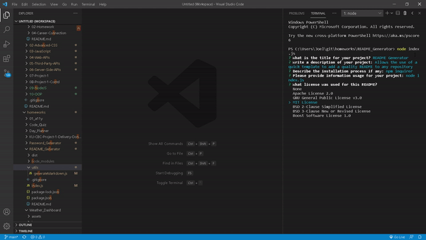

<h1 align="center">README.md Generator</h1>
   
  

   
## Description
  
 A Node.js application that uses user input from inquirer to populate a README markdown file for user repository. The README markdown file is created in the dist directory and can be found [here](.dist/README.md)

Below is the link to the video example of how it works:

[Video Presentation](./src/readme-generator-movie.mp4)

Here is a gif that higlights the creation of the README markdown  

## Table of Contents

- [Description](#description)
- [Installation](#installation)
- [Usage](#usage)
- [Contributing](#contributing)
- [Questions](#questions)

## Installation

`npm init`

`npm install inquirer`

## Usage

Run the following command at the root of your project and answer the prompted questions:

`node index.js`

## Contributing

[Joel Stockard](https://github.com/jtstockard)

## Questions

Contact me with any questions: [email](jtstockard92@gmail.com) , [GitHub](https://github.com/jtstockard) 

    
    
    
    
    
